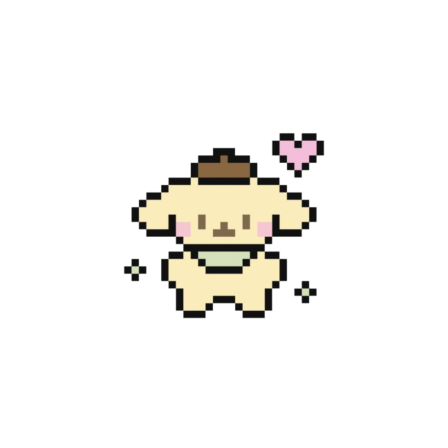
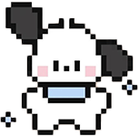
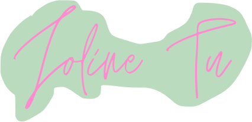

<html>
<head>
<meta charset="UTF-8">
<title>newhome</title>

</head>
<body onLoad="MM_preloadImages('joline2.png')">

  

        
        
<a href="projects/project1/index.html">Self Portrait</a>

    

    
  

    
        
<a href="projects/selflove.html">ABC's of CSS</a>

  

    
  

        
        
<a href="projects/project 4/prj4.html">Quotes</a>

  

    
  

        
        
<a href="inclass/week8.html">Divs and Behaviors</a>

  

    
  

        
        
<a href="gif-animation.html">Gif Animation</a>

  

  

        
  

	
</body>
</html>

